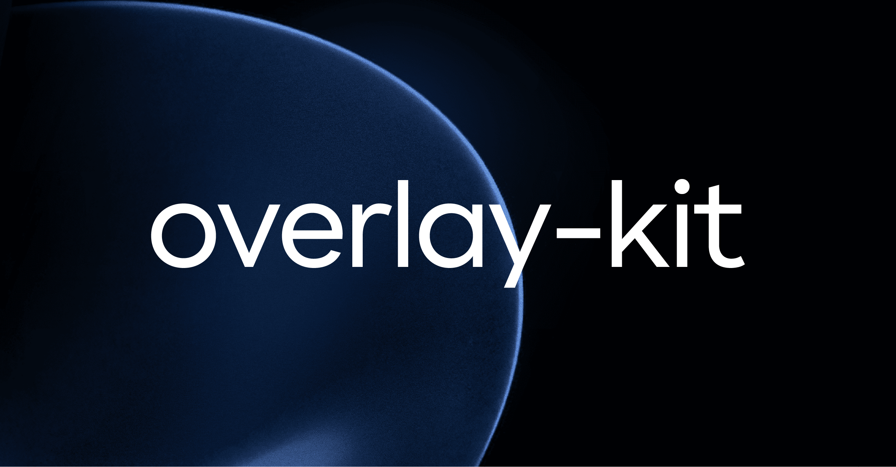

# overlay-kit &middot; [](https://github.com/toss/overlay-kit/blob/main/LICENSE) [](https://codecov.io/gh/toss/overlay-kit) [](https://deepwiki.com/toss/overlay-kit)

[English](https://github.com/toss/overlay-kit/blob/main/README.md) | [한국어](https://github.com/toss/overlay-kit/blob/main/README-ko_kr.md) | 日本語

overlay-kit は、React でモーダル、ポップアップ、ダイアログなどのオーバーレイを宣言的に管理するためのライブラリです。

複雑な状態管理や不要なイベントハンドリングなしに、効率的にオーバーレイを実装できます。

```sh
npm install overlay-kit
```

## 使い方

まず、プロバイダーを追加します。

```tsx
import { OverlayProvider } from 'overlay-kit';

const app = createRoot(document.getElementById('root')!);
app.render(
  <OverlayProvider>
    <App />
  </OverlayProvider>
);
```

### シンプルなオーバーレイを開く

`overlay.open` を使えば、オーバーレイを簡単に開いたり閉じたりできます。

```tsx
import { overlay } from 'overlay-kit';

<Button
  onClick={() => {
    overlay.open(({ isOpen, close, unmount }) => (
      <Dialog open={isOpen} onClose={close} onExit={unmount} />
    ))
  }}
>
  Open
</Button>
```

### 非同期オーバーレイを開く

`overlay.openAsync` を使えば、オーバーレイの結果を `Promise` として扱えます。

```tsx
import { overlay } from 'overlay-kit';

<Button
  onClick={async () => {
    const result = await overlay.openAsync<boolean>(({ isOpen, close, unmount }) => (
      <Dialog
        open={isOpen}
        onConfirm={() => close(true)}
        onClose={() => close(false)}
        onExit={unmount}
      />
    ))
  }}
>
  Open
</Button>
```

## なぜ overlay-kit を使うのか？

### 従来のオーバーレイ管理の問題点

1. 状態管理の複雑さ
   - `useState` やグローバルステートを使ってオーバーレイの状態を直接管理する必要がありました。
   - 状態管理と UI ロジックが混在し、コードが複雑になり可読性が低下していました。
2. イベントハンドリングの繰り返し
   - 開く、閉じる、結果を返すといったイベントハンドリングのコードを繰り返し書く必要がありました。
   - これがコードの重複を生み、開発体験を損ねる原因となっていました。
3. 再利用性の不足
   - オーバーレイから値を返すために、コールバック関数などを通じて UI とロジックが密結合していました。
   - その結果、コンポーネントの再利用が難しくなっていました。

### overlay-kit の目標

1. React の哲学に沿った設計
   - React は宣言的なコードを推奨しています。
   - overlay-kit は、オーバーレイを宣言的に管理できるよう支援します。
2. 開発生産性の向上
   - 状態管理とイベントハンドリングをカプセル化することで、開発者は UI とビジネスロジックに集中できます。
3. 拡張性と再利用性の強化
   - UI と動作を分離し、`Promise` を返す方式を採用することで、オーバーレイの再利用性を高めました。


## License

MIT © Viva Republica, Inc. 詳細は [LICENSE](https://github.com/toss/overlay-kit/blob/main/LICENSE) を参照してください。

<a title="Toss" href="https://toss.im">
  <picture>
    <source media="(prefers-color-scheme: dark)" srcset="https://static.toss.im/logos/png/4x/logo-toss-reverse.png">
    
  </picture>
</a>
