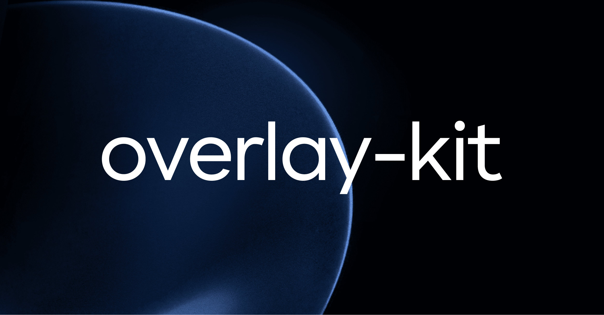

# overlay-kit &middot; [](https://github.com/toss/overlay-kit/blob/main/LICENSE) [](https://codecov.io/gh/toss/overlay-kit)

English | [한국어](https://github.com/toss/overlay-kit/blob/main/README-ko_kr.md)

overlay-kit is a library that lets you manage overlays in a simple and declarative way using React.

```tsx
import { overlay } from 'overlay-kit';

<Button
  onClick={() => {
    overlay.open(({ isOpen, close }) => {
      return <Dialog open={isOpen} onClose={close} />;
    })
  }}
>
  Open
</Button>
```

Here are the features overlay-kit provides:

- **Hassle-free**: overlay-kit makes overlay management straightforward with a simple function call: just call `overlay.open(...)`. See [the code comparison](https://overlay-kit.slash.page/en/docs/guides/code-comparison) for details.
- **Maximum Compatibility**: overlay-kit is compatible with the majority of overlay types. From Material UI to custom component libraries, overlay-kit can handle almost all types of overlays.
- **Promise Integration**: overlay-kit is easy to use with promises when getting results from overlays.
- **Robust Built-in Types**: overlay-kit offers robust types for all functions, ensuring type safety and enhancing the developer experience.

## License

MIT © Viva Republica, Inc. See [LICENSE](https://github.com/toss/overlay-kit/blob/main/LICENSE) for details.

<a title="Toss" href="https://toss.im">
  <picture>
    <source media="(prefers-color-scheme: dark)" srcset="https://static.toss.im/logos/png/4x/logo-toss-reverse.png">
    
  </picture>
</a>
